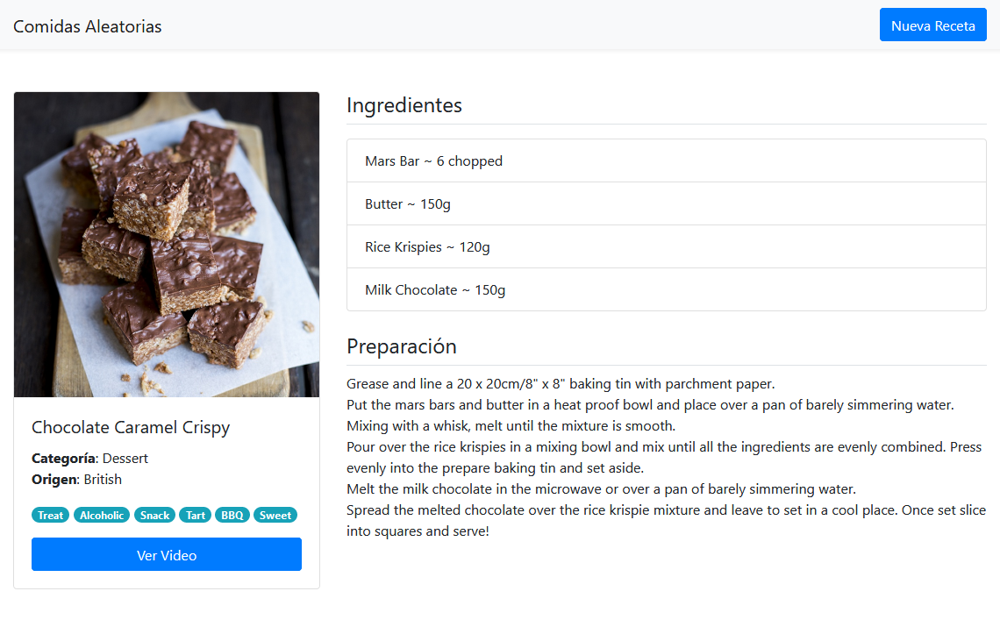

# springmvc-comidas-aleatorias
Un pequeño proyecto que muestra una de las tantas formas de consumir una API externa al sistema, esta vez a través de [ObjectMapper](https://fasterxml.github.io/jackson-databind/javadoc/2.11/com/fasterxml/jackson/databind/ObjectMapper.html) y [JsonNode](https://fasterxml.github.io/jackson-databind/javadoc/2.11/com/fasterxml/jackson/databind/JsonNode.html) de la librería [Jackson Data Processor](https://github.com/FasterXML/jackson).

Debido a la naturaleza de la API utilizada [TheMealDB](https://themealdb.com/api.php), opté por crear modelos para Etiquetas, Ingredientes y la Receta en sí, para luego traducir los atributos y dejarla más manejable desde el punto de vista práctico.

Siempre puede ser mejor

## Dependencias

### Java
Las librerías utilizadas en Java puedes visualizarlas en el archivo [pom.xml](pom.xml) del repositorio o en el apartado [Dependencias](https://github.com/rhacs/springmvc-comidas-aleatorias/network/dependencies) del mismo.

### JavaScript
Las dependencias JavaScript se manejan a través de la Red de Distribución de Contenidos (CDN: Content Delivery Network) [cdnjs.com](https://cndjs.com)

* [jQuery v3.5.1](https://jquery.com)
* [Popper js v1.16.1](https://popper.js.org/)
* [Twitter Bootstrap v4.5.3](https://getbootstrap.com/)
* [FancyBox v3.5.7](https://fancyapps.com/fancybox/3/)

## Resultado

